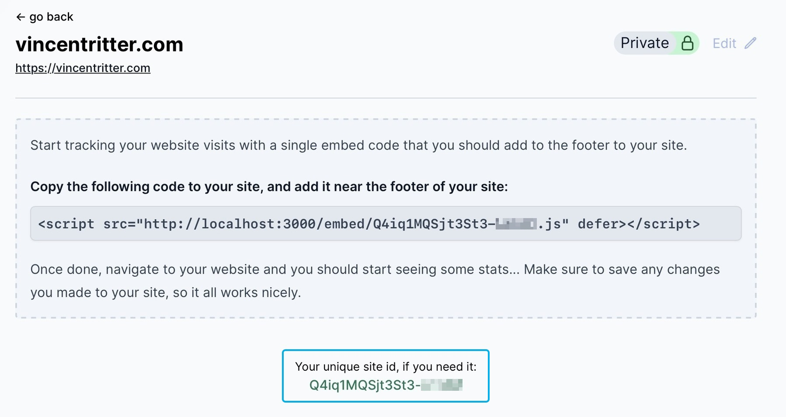

# Tinylytics-for-Micro.blog

A Micro.blog plugin to easily add Tinylytics tracking to your site.

## How To Use This Plug-in

First, if you haven't already, you'll need to sign up for a [Tinylytics.app](https://tinylytics.app) account to use this plug-in.

In the plug-in settings, enter your unique site id from your [Tinylytics.app](https://tinylytics.app) site configuration per this screenshot example:

## Displaying Hits

If you want to display hits somewhere on your site, check the "Display hits?" checkbox. You'll have to modify your Micro.blog theme on your own to get hits to display. See this Tinylytics [help article](https://tinylytics.app/docs/show_hit_counter) for an idea how to accomplish this. I cannot support theme modifications for this feature.

## Support

If you have questions or find a bug in the plug-in itself, hit me up on Micro.blog at [@jimmitchell](https://micro.blog/jimmitchell).

For Tinylytics support, please contact [@vincent](https://micro.blog/vincent) on Micro.blog.
