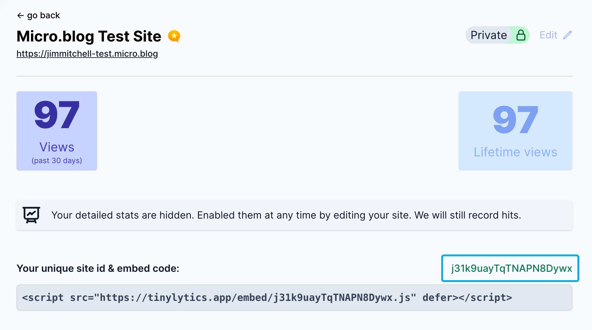

# Tinylytics-for-Micro.blog

A Micro.blog plug-in to easily add Tinylytics tracking to your site.

## How To Use This Plug-in

If you haven't already, you'll need to sign up for a [Tinylytics.app](https://tinylytics.app) account and configure a site for the plug-in to work.

Once installed, in the plug-in settings, enter your unique site id from your [Tinylytics.app](https://tinylytics.app) site configuration as shown in this screenshot:



## Displaying Hits

If you want to display hits somewhere on your site (say, the footer), check the "Display hits?" checkbox. You'll have to modify your Micro.blog theme on your own to get hits to display. 
Checkout the Tinylytics "[Showing a hit counter](https://tinylytics.app/docs/show_hit_counter)" help article for an idea how this is accomplished.

## Displaying Kudos

If you want to display a Kudos counter on individual post pages, check the "Show Kudos?" checkbox. You'll have to modify your Micro.blog theme on your own to get hits to display as well. I recommend adding the following code somewhere on your single post page:

````
<button class="tinylytics_kudos"></button>
````
See the Tinylytics "[Showing kudos](https://tinylytics.app/docs/showing_kudos)" help article for more details.

In addition to a Kudos counter, you can set a label using any combination of emoji and/or text. If you don't set a label on your own, the default will show up as "👋".

## Help

If you have questions or find a bug in the plug-in itself, hit me up on [Micro.blog](https://micro.blog/jimmitchell), [Mastodon](https://mastodon.social/@jimmitchell), or shoot me an [email](mailto:hello@jimmitchell.org).

For Tinylytics support, contact [@vincent](https://micro.blog/vincent) on Micro.blog or email him at [hello@tinylytics.app](mailto:hello@tinylytics.app).
