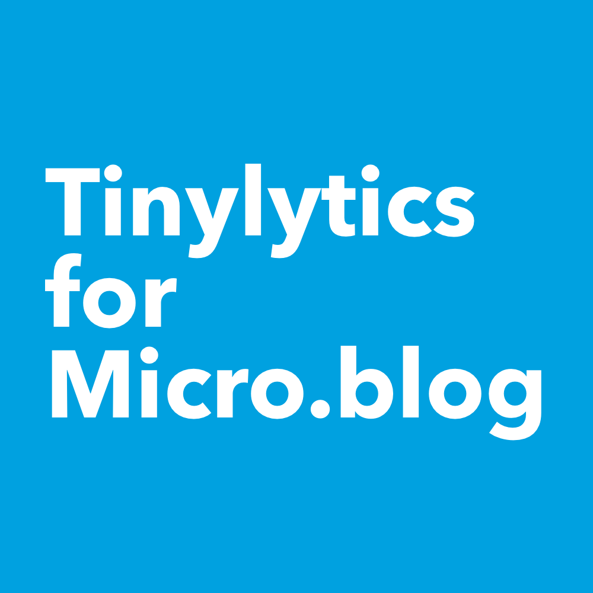

# Tinylytics-for-Micro.blog



A Micro.blog plug-in to easily add Tinylytics tracking to your site.

## How To Use This Plug-in

Before anything else, you'll need to sign up for a [Tinylytics.app](https://tinylytics.app) account for the plug-in to work.

Once you have the plug-in installed, enter your unique site id from your [Tinylytics.app](https://tinylytics.app) site configuration page:


## Displaying Hits

If you want to display the total hits somewhere on your site, check the "Display hits?" checkbox. Checkout the Tinylytics "[Showing a hit counter](https://tinylytics.app/docs/show_hit_counter)" help article for more details.

## Displaying Post Kudos

If you want to display a Kudos counter on individual post pages, check the "Show Kudos?" checkbox. See the Tinylytics "[Showing kudos](https://tinylytics.app/docs/showing_kudos)" help article for more details. In addition to a Kudos counter, you can set a label using any combination of emoji and/or text. If you don't set your own label, the default emoji will be "👋".

## Displaying Uptime

If you want to display the uptime of your site, check the "Display Uptime?" checkbox. Checkout the Tinylytics "[Showing Uptime on your site](https://tinylytics.app/docs/showing_uptime)" help article for more details. **Note:** Uptime monitoring is a paid account feature. If you enable the "Display Uptime?" checkbox but do not have a paid account, you'll only see an uptime label.

## Shortcodes

If you'd like to avoid making changes to your theme template files, you can use shortcodes instead. To add a kudos or post view counter to a post, simply add them using the following shortcodes:

````

 
````

An example of that might look something like this:


**A new feature:** Adding a ```` shortcode to a post will give a number of views for just that post, not the overall site views.

## Showing Total Hits and Uptime in Your Micro.blog Footer

Maybe you'd like to display a hit counter in the global custom footer of your Micro.blog without having to change any template files. Since shortcodes do not work in the Micro.blog custom footer, this can be accomplished using a partial embed instead.

````
{{ partial "tinyhits/embed.html" (dict "context" . ) }}
````

An example of that looks something like this:


## Tinylytics Styles

Out of the box, Tinylytics works great without any styles applied, but if you'd like to tweak how things look to better match your site, here are the CSS classes:

````
.tiny_counter {
    /* Styles the entire counter <span> for a custom footer embed only */
}

.tiny_counter {
    /* Styles the uptime <span> for a custom footer embed only */
}

.tinylytics_hits {
    /* Styles the hit counter number. Works for both shortcode and embed methods. */
}

.tinylytics_kudos {
    /* this class styles the entire Kudos button. Works for both shortcode and embed methods. * /
}

.did_select {
    /* Styles the Kudos button to appear different/inactive once a Kudo is given. Works for both shortcode and embed methods. */
}
````

## Need Help?

If you have questions or find a bug in the plug-in itself, hit me up on [Micro.blog](https://micro.blog/jimmitchell), [Mastodon](https://mastodon.social/@jimmitchell), or go old-school and shoot me an [email](mailto:hello@jimmitchell.org). For Tinylytics support, contact [@vincent](https://micro.blog/vincent) on Micro.blog, or email him at [hello@tinylytics.app](mailto:hello@tinylytics.app).

## Support Continued Development

Finally, if you find this plug-in is worth supporting financially, you can make a donation on my [Ko-fi](https://ko-fi.com/jimmitchellmedia) page. If you do, thank you very much in advance for your support.
